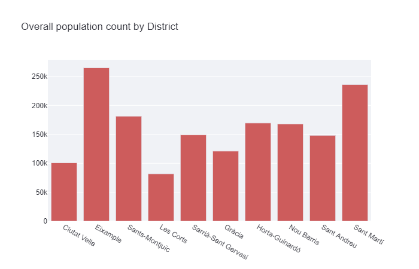

# Streamlit Dashboard + API for Barcelona city data🏰

This is my mid-project for the **BIG DATA & MACHINE LEARNING BOOTCAMP** I am taking at **Core CODE School**.
As an Abstract, this is a Streamlit dashboard that makes requests to an API and shows some charts. The requested API get the info from a MongoDB Database with some datasets from Barcelona. Every one of those communication elements were performed on this project.
#
#
#
# Overview  
#### _Data collected_

The origin data was collected from this [Barcelona dataset](https://www.kaggle.com/xvivancos/barcelona-data-sets) from Kaggle and later, the infomation has been enriched by expanding it with more data, by collecting it directly from the [Open Data BCN API](https://opendata-ajuntament.barcelona.cat/en), the Ajuntament de Barcelona's open data service.

#### _MongoDB Database_

This datasets where reviewed and cleaned to being uploaded into a MongoDB Database in a cluster on cloud. This task was carried out with **Jupyter Notebooks**.

#
#
#
#
# How it works?
### _API endpoints_

There are 2 ways to make requests to the API:
- Sending **query parameters** in the request.
- Using some already created **ENDPOINTS**.
#
#
**-  Query Parameters:**
The request must be directed to the **API url** + **"/read/<collection>"** + **"Query Parameters"** where the string <colllection> must be one from the database ("population","unemployed"), and the "query parameters" must match the titles of the columns of the same collection:

**Example:** url = "http:// localhost:port/read/population?Year=2018&District.Name=Ciutat Vella"
#
#
#
**- ENDPOINTS :**
There are some Endpoints already implemented in the **API** like the "/read/<collection>" one. Those are:
- **/bcn-population-by-year/<year>** gives all the population by the selected year
- **/bcn-population-by-district/<name>** gives all the population by the selected district
- **/bcn-population-by-neighborhood/<name>** gives all the population by the selected Neighborhood
- **/bcn-unemployment-by-year/<year>** gives all the registered unemployees by the selected year
- **/bcn-unemployed-by-district/<name>** gives all the registered unemployees by the selected district
- **/bcn-unemployed-by-neighborhood/<name>** gives all the registered unemployees by the selected Neighborhood

#
#
#
#
## Streamlit Dashboard

Finally, it was performed an Streamlit dashboard to make the requests and representing some charts about the information.

#
#
#
## Tecnologies & Resources

- flask
- streamlit
- pandas
- plotly
- mongoDB
